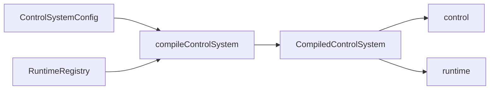

# `precurator`

Language: English | [Русский](README_ru.md) | [中文](README_ch.md)

`precurator` is a TypeScript library for building checkpoint-aware control loops for AI systems on top of LangGraph.

It is meant for systems that stop being simple after the first successful run. Once "build a graph and call it" is no longer enough, you usually need a few more things at once: structured error signals, bounded prompt memory, pause and resume semantics, simulation branches, and a state model you can inspect without digging through opaque chain internals.

`precurator` does not replace LangGraph. It mainly puts structure around the parts that are easy to improvise in plain LangGraph and hard to keep tidy over time: JSON-ready config as the source of truth, runtime-bound handlers through registries, explicit `control` versus `runtime` state, and a lifecycle that works for long-running threads instead of one-shot orchestration.

## Requirements

- Node.js `>=20`
- Bun `>=1.2`

## Install

```bash
npm install precurator @langchain/core @langchain/langgraph zod
```

```bash
bun add precurator @langchain/core @langchain/langgraph zod
```

`@langchain/core`, `@langchain/langgraph`, and `zod` are peer dependencies. That keeps `precurator` easy to embed into an existing LangGraph stack without forcing duplicate runtimes or hidden provider choices.

## Why This Exists

LangGraph is flexible enough to let you assemble all of this yourself. That is convenient at first. A bit later, it becomes obvious that a working demo and a manageable runtime are not the same thing.

Once a system has to run for many steps, survive pauses, keep prompt-facing memory bounded, expose machine-readable progress signals, and separate dry-run branches from reality-facing execution, the missing work is no longer "one more node". You need clearer rules for how the loop actually runs.

`precurator` is for that part.

Use it when your system needs most of the following:

- a serializable `ControlSystemConfig` as the canonical description of the loop;
- a clean boundary between domain truth in `control` and execution metadata in `runtime`;
- deterministic stop conditions such as `epsilon`, `maxIterations`, verifier decisions, or token budget;
- checkpoint-aware `interrupt`, `resume`, and `abort`;
- bounded memory with explicit compaction rather than ever-growing prompt history;
- `simulation: true` branches that cannot silently perform destructive side effects;
- telemetry that is useful for operators, dashboards, and audit flows.

If you are building a short single-shot agent or a mostly linear workflow, plain LangGraph is often enough. `precurator` becomes useful when drift, convergence, operator intervention, and reproducible lifecycle behavior start to matter.

This is control-inspired infrastructure for AI agents, not a classical control-analysis package. The vocabulary borrows from observation, comparison, verification, and correction because that language maps well to the loop. The implementation stays practical: TypeScript, LangGraph, and explicit runtime contracts.

## Mental Model

The entrypoint is `compileControlSystem(config, runtimeRegistry)`.

- `config` describes what the system is in a JSON-ready form.
- `runtimeRegistry` provides what the system needs at runtime: observers, comparators, verifiers, tools, models, summarizers, and a checkpointer.
- the compiled result is still a LangGraph runtime, but with a more explicit contract for state, lifecycle, and safety.



Two ideas matter more than anything else.

### 1. Config Stays Serializable

`ControlSystemConfig` stores references such as `observerRef`, `verifierRef`, `comparatorRef`, `toolRefs`, and `modelRef`.

Those are not "magic strings". They are stable keys into the `RuntimeRegistry`. The goal is to keep config and checkpointed state JSON-ready while still binding real handlers, SDK clients, models, and tools in the current process.

That split is what lets the same declarative loop remain serializable, testable, and checkpoint-safe.

### 2. State Is Split On Purpose

`ControlState<TTarget, TCurrent>` is divided into two layers:

- `control`: target, current domain state, structured error signals, bounded short-term memory, optional prediction;
- `runtime`: iteration index, status, stop reason, diagnostics, checkpoint metadata, token budget, simulation flag, human decisions, trace metadata.

This makes a long-running run much easier to inspect. `runtime` tells you how the loop is behaving. `control` remains the source of truth about what the loop is trying to change.

## What Actually Runs

The public loop is easiest to think about as:

`observe -> compare -> verify -> compactMemory`

That framing matters for two reasons:

- there is no hidden planner node doing secret orchestration behind the scenes;
- if your domain has richer planning or effect execution, you model it explicitly through your observer, comparator, verifier, and runtime tools.

That usually means `precurator` becomes the control shell around an existing LangGraph application, harness, or domain-specific runtime, not a replacement for every piece of reasoning you already have.

## Quick Start

The smallest runnable example is in `examples/hello-world/`. It is intentionally simple because the goal is to show the lifecycle contract in the shortest possible form, not to pretend that a counter is a realistic agent.

```ts
import { z } from "zod";
import { compileControlSystem } from "precurator";

const system = compileControlSystem(
  {
    schemas: {
      target: z.object({ value: z.number() }),
      current: z.object({ value: z.number() })
    },
    stopPolicy: {
      epsilon: 0.05,
      maxIterations: 3
    },
    memory: {
      maxShortTermSteps: 4,
      compactionStrategy: "summarize-oldest",
      summaryReplacementSemantics: "replace-compacted-steps"
    },
    observerRef: "increment-observer",
    verifierRef: "pause-once-verifier"
  },
  {
    observers: {
      "increment-observer": ({ current, target }) => ({
        value: Math.min(current.value + 2, target.value)
      })
    },
    verifiers: {
      "pause-once-verifier": ({ current, history }) => {
        if (current.value === 4 && history.length === 1) {
          return {
            status: "awaiting_human_intervention" as const,
            stopReason: "manual-review"
          };
        }

        return {
          status: "optimizing" as const
        };
      }
    }
  }
);

const interrupted = await system.invoke({
  target: { value: 50 },
  current: { value: 2 },
  metadata: {
    thread_id: "hello-world"
  }
});

const snapshot =
  interrupted.runtime.status === "awaiting_human_intervention"
    ? await system.resume(interrupted, {
        current: { value: 5 },
        humanDecision: {
          action: "resume",
          approvedBy: "operator"
        }
      })
    : interrupted;
```

### Reading The Example

The example keeps a few shortcuts intentionally visible:

- `"increment-observer"` is just a registry key. The config stores a reference, and the runtime registry maps it to a real handler.
- the observer increments by `2` because the example wants deterministic motion that is easy to read at a glance.
- `epsilon: 0.05` and `maxIterations: 3` are not tuned for optimal behavior. They keep the example short while still showing how stop-policy wiring works.
- `"pause-once-verifier"` is a verifier whose only job is to pause the loop once through a checkpoint so that `awaiting_human_intervention`, `resume()`, and `humanDecision` all show up in a minimal example.
- `current.value === 4 && history.length === 1` is not a control heuristic. It means "pause after the first completed step, once".
- `thread_id: "hello-world"` gives the run a stable LangGraph thread identity so checkpoints and later state lookups stay attached to the same thread.
- `resume(..., { current: { value: 5 } })` demonstrates operator-provided state correction. It is there to show the intervention API, not to suggest that manual overrides should replace ordinary observation.

Even this tiny example already shows the library's basic shape:

- a compiled LangGraph runtime with typed `invoke`, `interrupt`, `resume`, `abort`, `getState`, and `getThreadConfig`;
- a state model where `runtime.status`, `stopReason`, and `diagnostics` are part of the contract rather than incidental byproducts;
- bounded prompt-facing memory that remains serializable and checkpoint-safe.

If you want the smallest possible path through the lifecycle, start with `examples/hello-world/`.

## What You Get Operationally

### Checkpoint-Aware Lifecycle

`precurator` treats long-running execution as a lifecycle, not as an ad-hoc loop wrapped around `invoke()`.

You can:

- pause by returning `awaiting_human_intervention` from a verifier or by calling `interrupt(snapshot, humanDecision?)`;
- continue with `resume(snapshot, { current?, humanDecision? })`;
- terminate with `abort(snapshot, humanDecision?)`;
- recover the thread through `getState()` and `getThreadConfig()`.

The contract is built around LangGraph checkpoints rather than hidden suspended state in memory.

### Comparator And Verifier Are Different Jobs

`precurator` draws a hard line between comparison and verification.

- comparators compute `errorVector`, `errorScore`, `deltaError`, `errorTrend`, and optional `prediction`;
- verifiers decide whether the loop should keep running, stop, fail, or escalate.

That distinction matters in real systems. The component that computes error does not have to be the same component that decides progress is good enough to count.

### Simulation Is A Safety Boundary

Pass `simulation: true` to `invoke()` and the runtime executes an isolated preview branch.

In simulation mode:

- the branch has its own thread namespace;
- destructive tools are blocked unless they explicitly expose `dryRun`;
- the state remains serializable and separate from the main branch;
- the same loop can compare preview and reality without leaking side effects across them.

This is useful when the system needs to rehearse a trajectory before acting on real infrastructure, data, or users.

### Bounded Memory Is Part Of The Contract

`shortTermMemory` is intentionally finite.

It stores:

- a working window in `steps`;
- an optional `summary` for compacted older context.

Built-in compaction strategies:

- `sliding-window`
- `summarize-oldest`
- `hybrid`

You can also plug in a custom summarizer through `RuntimeRegistry.summarizeCompactedSteps`.

The point is not the list of strategies by itself. The point is that prompt-facing memory is bounded by contract rather than left to drift into an unbounded transcript.

### Telemetry Stays Outside Checkpointed State

The compiled system emits runtime lifecycle events:

- `step:completed`
- `step:interrupted`

Payloads include fields such as `error_score`, `delta_error`, `error_trend`, `simulation`, `checkpoint_id`, and optionally `thread_id`.

That makes it straightforward to build dashboards, traces, reports, or alerting without leaking closures or UI collectors into checkpointed state.

## How This Fits Into A Real Project

The most common integration path is not "replace everything with `precurator`". It usually looks more like this:

1. keep your domain model and LangGraph application logic;
2. encode the control loop contract in `ControlSystemConfig`;
3. bind actual observers, verifiers, tools, models, and checkpointer in `RuntimeRegistry`;
4. let `precurator` own the lifecycle invariants: bounded memory, stop policy, simulation safety, checkpoint-aware pauses, and structured diagnostics.

That usually means:

- SDK clients, database handles, and provider instances live in registries, not in config or state;
- your domain-specific observation or actuation logic can stay inside handlers you already understand;
- existing harness code can often sit behind `observerRef`, `toolRefs`, or `verifierRef`;
- thread and checkpoint management become explicit runtime concerns instead of incidental helper code.

If you are already using LangGraph, `precurator` is best seen as a layer that brings more structure to stateful, long-horizon agent loops.

## Examples

### `examples/hello-world/`

This is the shortest route to the public lifecycle:

- compile from config and registry;
- invoke a thread;
- pause through a verifier;
- resume with operator input;
- inspect the resulting runtime state.

Use it to understand the API, not as the final shape of a production agent.

### `examples/aeolus/`

`Aeolus` is the more substantial example. It is useful when you want to look at a longer-running scenario with preview mode, external disturbance, and telemetry instead of a toy counter.

Live demo: [pikulev.github.io/precurator](https://pikulev.github.io/precurator/)

It demonstrates:

- `simulation: true` as a preview branch with disturbance disabled;
- a reality branch where the same loop faces external disturbance;
- escalation through the verifier when predicted and observed motion diverge;
- bounded-memory compaction with a visible summary signal;
- telemetry collection and report generation outside checkpointed state.

It also makes it clearer where the domain logic actually lives.

- the physics-style plant dynamics are implemented in `examples/aeolus/domain.ts`;
- the loop orchestration comes from `precurator`;
- reproducibility comes from explicit seeded context, not from hidden runtime magic;
- the dashboard collector stays outside `ControlState`, which is the separation you usually want in a checkpointed system.

If `hello-world` explains the API, `Aeolus` shows what the same approach looks like in a more realistic scenario.

For a deeper walkthrough, see `docs/EXAMPLE-AEOLUS.md`.

Generate the report locally with `bun run demo:aeolus`. Build the GitHub Pages bundle with `bun run build:pages`.

## Compact Contract Overview

You do not need to memorize the full type surface to understand the library. These are the contracts that matter on a first read.

### `ControlSystemConfig<TTarget, TCurrent>`

Describes the loop in a JSON-ready form.

- `schemas?`: Zod validation for `target` and `current`
- `stopPolicy`: `{ epsilon, maxIterations, maxTokenBudget? }`
- `memory?`: bounded-memory behavior
- `mode?`: `"conservative" | "balanced" | "aggressive"`
- `modelRef?`, `observerRef?`, `verifierRef?`, `comparatorRef?`, `toolRefs?`

### `RuntimeRegistry<TTarget, TCurrent>`

Resolves config references into executable runtime behavior.

- `models?`
- `observers?`
- `verifiers?`
- `comparators?`
- `tools?`
- `tokenBudgetEstimator?`
- `summarizeCompactedSteps?`
- `checkpointer?`

### `ControlState<TTarget, TCurrent>`

The inspectable state contract.

- `control`: target, current state, error signals, bounded memory, optional prediction
- `runtime`: status, iteration, diagnostics, checkpoint metadata, simulation flag, operator context

### `CompiledControlSystem<TTarget, TCurrent>`

The runtime you actually execute.

- `invoke()`
- `interrupt()`
- `resume()`
- `abort()`
- `getState()`
- `getThreadConfig()`
- `on()`

## Deterministic Helpers

For synthetic tests and deterministic loops, the package also exports helpers:

```ts
import { deriveErrorTrend, deterministicComparator } from "precurator";

const comparison = deterministicComparator({
  target: { value: 10 },
  current: { value: 7 },
  previousErrorScore: 0.5
});

const trend = deriveErrorTrend([0.5, 0.3, 0.4]);
```

These helpers are useful when you want to test convergence and verifier behavior without a live model in the loop.

## Development

```bash
bun install
bun run verify
bun run demo:aeolus
```

## Repository Layout

- `src/`: public contracts, runtime implementation, comparator, and memory helpers
- `tests/`: unit, integration, packaging, and typing checks
- `examples/hello-world/`: minimal runnable lifecycle example
- `examples/aeolus/`: long-horizon demo with preview, disturbance, telemetry, and report artifacts
- `docs/`: ADRs, example walkthroughs, TDD plan, and publish-readiness criteria
- `.cursor/rules/`: persistent guidance for coding agents
