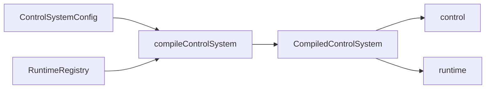

# `precurator`

[English](README.md) | [Русский](README_ru.md) | 中文

`precurator` 是一个 TypeScript 库，用于在 LangGraph 之上为 AI 系统构建具备 checkpoint 感知能力的控制循环。

它面向那些在第一个成功场景之后就不再简单的系统。等到“把图搭起来再调用一下”已经不够用时，通常还会同时冒出几件事：结构化错误信号、有限的 prompt 内存、暂停与恢复语义、simulation 分支，以及一个不用去倒推黑盒链式内部实现也能看懂的状态模型。

`precurator` 并不取代 LangGraph。更准确地说，它把原生 LangGraph 里那些很容易临时拼出来、却不容易长期保持整洁的部分整理清楚：以可 JSON 化的配置作为事实来源，通过 registry 绑定运行时处理器，显式区分 `control` 与 `runtime` 状态，并为长时间运行的线程而不是一次性编排设计生命周期。

## 要求

- Node.js `>=20`
- Bun `>=1.2`

## 安装

```bash
npm install @piklv/precurator @langchain/core @langchain/langgraph zod
```

```bash
bun add @piklv/precurator @langchain/core @langchain/langgraph zod
```

`@langchain/core`、`@langchain/langgraph` 和 `zod` 是 peer dependencies。这样可以让 `precurator` 更容易嵌入现有的 LangGraph 技术栈，而不会强制引入重复 runtime 或隐藏的 provider 选择。

## 为什么需要它

LangGraph 足够灵活，你完全可以自己把这些东西拼起来。刚开始这很方便，但很快就会发现：一个能跑的 demo，和一个可控、可维护的 runtime，并不是一回事。

一旦系统需要运行很多步、能跨暂停继续执行、保持面向 prompt 的内存有界、暴露机器可读的进度信号，并将 dry-run 分支与面向真实世界的执行分离，缺的就不再只是“再加一个 node”。你需要的是一套更清楚的运行规则。

`precurator` 处理的正是这一层。

当你的系统需要具备以下大部分能力时，可以考虑使用它：

- 以可序列化的 `ControlSystemConfig` 作为循环的规范描述；
- 在 `control` 中保存领域事实，在 `runtime` 中保存执行元数据，两者之间有清晰边界；
- 具备确定性的停止条件，例如 `epsilon`、`maxIterations`、verifier 决策或 token 预算；
- 具备 checkpoint 感知的 `interrupt`、`resume` 与 `abort`；
- 具备有界内存，并通过显式压缩而不是无限增长的 prompt 历史来管理上下文；
- 具备 `simulation: true` 分支，且这些分支不会悄悄执行破坏性副作用；
- 具备对操作人员、仪表盘与审计流程都有价值的 telemetry。

如果你构建的是一个短流程、一次性 agent，或者一个大体线性的 workflow，那么原生 LangGraph 往往已经足够。`precurator` 更适合那些已经开始关心漂移、收敛、人工干预以及可复现生命周期行为的场景。

这是面向 AI agent 的、受控制论启发的基础设施，而不是传统的控制分析包。它借用了 observation、comparison、verification 与 correction 这些术语，因为它们很适合描述这个循环；但实现本身仍然是很实际的 TypeScript、LangGraph 和显式的 runtime 契约。

## 心智模型

入口是 `compileControlSystem(config, runtimeRegistry)`。

- `config` 以可 JSON 化的形式描述系统“是什么”。
- `runtimeRegistry` 提供系统运行时所需的内容：evolver、comparator、verifier、tool、model、summarizer 与 checkpointer。
- 编译结果仍然是一个 LangGraph runtime，但它对状态、生命周期与安全性施加了更明确的契约。



有两个核心理念尤其重要。

### 1. 配置必须保持可序列化

`ControlSystemConfig` 存储的是诸如 `evolveRef`、`verifierRef`、`comparatorRef`、`toolRefs` 和 `modelRef` 这样的引用。

这些并不是什么“魔法字符串”。它们是指向 `RuntimeRegistry` 的稳定 key。目的就是让配置与 checkpoint 状态始终保持可 JSON 化，同时又能在当前进程里绑定真实的 handler、SDK client、model 与 tool。

这种分离使同一个声明式循环能够同时保持可序列化、可测试以及 checkpoint-safe。

### 2. 状态分层是有意设计

`ControlState<TTarget, TCurrent>` 被划分为两层：

- `control`：目标、当前领域状态、结构化错误信号、有界短期记忆，以及可选的 prediction；
- `runtime`：迭代索引、状态、停止原因、诊断信息、checkpoint 元数据、token 预算、simulation 标记、人工决策与 trace 元数据。

这样一来，长时间运行的过程就更容易检查了。`runtime` 告诉你循环是怎么运作的；`control` 则仍然是循环试图改变什么的事实来源。

## 实际运行的内容

当前发布的 runtime，比 ADR 中更宽泛的控制论语言要更收敛。

就目前而言，公开循环最容易理解为：

`evolve -> compare -> verify -> compactMemory`

这种表述之所以重要，有两个原因：

- 幕后没有一个隐藏的 planner node 在秘密地做编排；
- `evolve` 这个名字是刻意选择的：公开步骤既可能读取，也可能施加动作，然后再返回下一个 `current`，因此单纯叫 `observer` 过于狭窄；
- 如果你的领域需要更丰富的规划或效果执行，你需要通过自己的 evolver、comparator、verifier 与 runtime tool 显式建模。

对于高级用户，这通常意味着 `precurator` 作为一个控制外壳包裹现有的 LangGraph 应用、harness 或领域专用 runtime，而不是替代你已有的全部推理组件。

## 快速开始

最小可运行示例位于 `examples/hello-world/`。它被刻意设计得非常简单，因为目标是用最短的路径展示生命周期契约，而不是假装一个计数器就是现实中的 agent。

```ts
import { z } from "zod";
import { compileControlSystem } from "@piklv/precurator";

const system = compileControlSystem(
  {
    schemas: {
      target: z.object({ value: z.number() }),
      current: z.object({ value: z.number() })
    },
    stopPolicy: {
      epsilon: 0.05,
      maxIterations: 3
    },
    memory: {
      maxShortTermSteps: 4,
      compactionStrategy: "summarize-oldest",
      summaryReplacementSemantics: "replace-compacted-steps"
    },
    evolveRef: "increment-evolver",
    verifierRef: "pause-once-verifier"
  },
  {
    evolvers: {
      "increment-evolver": ({ current, target }) => ({
        value: Math.min(current.value + 2, target.value)
      })
    },
    verifiers: {
      "pause-once-verifier": ({ current, history }) => {
        if (current.value === 4 && history.length === 1) {
          return {
            status: "awaiting_human_intervention" as const,
            stopReason: "manual-review"
          };
        }

        return {
          status: "optimizing" as const
        };
      }
    }
  }
);

const interrupted = await system.invoke({
  target: { value: 50 },
  current: { value: 2 },
  metadata: {
    thread_id: "hello-world"
  }
});

const snapshot =
  interrupted.runtime.status === "awaiting_human_intervention"
    ? await system.resume(interrupted, {
        current: { value: 5 },
        humanDecision: {
          action: "resume",
          approvedBy: "operator"
        }
      })
    : interrupted;
```

### 如何理解这个示例

这个例子里有几处刻意保留下来的简化：

- `"increment-evolver"` 只是一个 registry key。配置保存的是引用，而 runtime registry 会把它映射到真实的 handler。
- evolver 每次加 `2`，只是为了让推进过程保持确定性，并且一眼就能看明白。
- `epsilon: 0.05` 和 `maxIterations: 3` 并不是为了最优行为而调参，它们只是让示例足够短，同时还能说明 stop-policy 是怎么接上的。
- `"pause-once-verifier"` 是一个 verifier，它唯一的职责就是通过 checkpoint 强制暂停一次，这样 `awaiting_human_intervention`、`resume()` 和 `humanDecision` 都能在最小示例中出现。
- `current.value === 4 && history.length === 1` 不是控制启发式，它的含义只是“在第一个完整步骤结束后暂停一次”。
- `thread_id: "hello-world"` 为运行提供一个稳定的 LangGraph 线程标识，因此 checkpoint 与后续状态查询会始终附着在同一线程上。
- `resume(..., { current: { value: 5 } })` 用来演示由操作员提供的状态修正。它展示的是人工干预 API，而不是建议你用手工覆盖来替代正常的状态演化。

即使只是这样一个很小的示例，也已经能看出这个库的基本轮廓：

- 一个编译后的 LangGraph runtime，带有类型化的 `invoke`、`interrupt`、`resume`、`abort`、`getState` 和 `getThreadConfig`；
- 一个状态模型，其中 `runtime.status`、`stopReason` 与 `diagnostics` 是契约的一部分，而不是偶然副产物；
- 有界的、面向 prompt 的内存，且它保持可序列化与 checkpoint-safe。

如果你想沿着生命周期走一条最短路径，直接从 `examples/hello-world/` 开始。

## 你在运行层面能得到什么

### 具备 Checkpoint 感知的生命周期

`precurator` 将长时间运行的执行视为一个生命周期，而不是围绕 `invoke()` 临时包出来的循环。

你可以：

- 通过 verifier 返回 `awaiting_human_intervention`，或调用 `interrupt(snapshot, humanDecision?)` 来暂停；
- 使用 `resume(snapshot, { current?, humanDecision? })` 继续；
- 使用 `abort(snapshot, humanDecision?)` 终止；
- 通过 `getState()` 与 `getThreadConfig()` 恢复线程。

这个契约建立在 LangGraph checkpoint 之上，而不是依赖内存中隐藏的挂起状态。

### Comparator 与 Verifier 是不同职责

`precurator` 在 comparison 与 verification 之间画了一条硬边界。

- comparator 负责计算 `errorVector`、`errorScore`、`deltaError`、`errorTrend` 与可选的 `prediction`；
- verifier 负责决定循环应当继续运行、停止、失败还是升级处理。

这种区分在真实系统中非常重要。负责计算误差的组件，不必和负责判断“这算不算有效进展”的组件是同一个。

### Simulation 是一道安全边界

向 `invoke()` 传入 `simulation: true`，runtime 就会执行一个隔离的预览分支。

在 simulation 模式下：

- 分支拥有自己的线程命名空间；
- 破坏性 tool 会被阻止，除非它们显式暴露 `dryRun`；
- 状态保持可序列化，并与主分支分离；
- 同一个循环可以对比预览与现实，而不会让副作用在两者之间泄漏。

当系统需要在操作真实基础设施、数据或用户之前先排练一条轨迹时，这一点尤其有用。

### 有界内存是契约的一部分

`shortTermMemory` 被有意设计为有限大小。

它包含：

- `steps` 中的工作窗口；
- 用于保存压缩后旧上下文的可选 `summary`。

内置压缩策略：

- `sliding-window`
- `summarize-oldest`
- `hybrid`

你也可以通过 `RuntimeRegistry.summarizeCompactedSteps` 接入自定义 summarizer。

重点不在于策略列表本身。真正重要的是：面向 prompt 的内存是通过契约被限制住的，而不是任其漂移成一个无限增长的 transcript。

### Telemetry 保持在 Checkpoint 状态之外

编译后的系统会发出 runtime 生命周期事件：

- `step:completed`
- `step:interrupted`

payload 中包含诸如 `error_score`、`delta_error`、`error_trend`、`simulation`、`checkpoint_id`，以及可选的 `thread_id` 等字段。

这让你可以轻松构建 dashboard、trace、report 或告警，而不需要把 closure 或 UI collector 泄漏进 checkpoint 状态。

## 它如何融入真实项目

最常见的集成路径并不是“用 `precurator` 替换一切”，而更接近下面这样：

1. 保留你的领域模型与 LangGraph 应用逻辑；
2. 在 `ControlSystemConfig` 中编码控制循环契约；
3. 在 `RuntimeRegistry` 中绑定真实的 evolver、verifier、tool、model 与 checkpointer；
4. 让 `precurator` 负责生命周期不变式：有界内存、停止策略、simulation 安全、checkpoint 感知的暂停，以及结构化诊断。

这通常意味着：

- SDK client、数据库句柄与 provider 实例应存在于 registry 中，而不是 config 或 state 中；
- 你的领域专用 observation 或 actuation 逻辑可以继续放在你已经熟悉的 handler 中；
- 现有 harness 代码通常可以挂在 `evolveRef`、`toolRefs` 或 `verifierRef` 后面；
- thread 与 checkpoint 管理会成为显式的 runtime 关注点，而不再只是零散的辅助代码。

如果你已经在使用 LangGraph，那么更容易理解的方式是：`precurator` 是一层用来给有状态、长周期 agent 循环理顺结构的外壳。

## 示例

### `examples/hello-world/`

这是通往公开生命周期的最短路径：

- 从 config 与 registry 编译；
- 调用一个线程；
- 通过 verifier 暂停；
- 带着操作员输入恢复；
- 检查最终的 runtime 状态。

用它来理解 API，而不是把它当成生产级 agent 的最终形态。

### `examples/aeolus/`

`Aeolus` 是更完整的示例。如果你想看的不是玩具计数器，而是一个带 preview、外部扰动和 telemetry 的长流程场景，它会更有参考价值。

在线演示: [pikulev.github.io/precurator](https://pikulev.github.io/precurator/)

它展示了：

- `simulation: true` 作为关闭扰动的预览分支；
- 一个现实分支，其中同一个循环面对外部扰动；
- 当预测运动与观测运动发散时，通过 verifier 触发升级处理；
- 带有可见 `summary` 信号的有界内存压缩；
- 位于 checkpoint 状态之外的 telemetry 收集与 report 生成。

同时，这个示例也更清楚地说明了领域逻辑应该放在哪里。

- 物理系统风格的 plant dynamics 实现在 `examples/aeolus/domain.ts`；
- 循环编排来自 `precurator`；
- 可复现性来自显式的 seeded context，而不是隐藏的 runtime 魔法；
- dashboard collector 保持在 `ControlState` 之外，而这通常正是 checkpointed 系统里更合适的分离方式。

如果说 `hello-world` 主要是帮助你快速看懂 API，那么 `Aeolus` 展示的就是同一套思路放到更真实场景里会是什么样子。

如需更深入的讲解，请参见 `docs/EXAMPLE-AEOLUS.md`。

本地生成报告可运行 `bun run demo:aeolus`。构建 GitHub Pages 产物可运行 `bun run build:pages`。

## 精简契约总览

你不需要记住完整的类型表面也能理解这个库。第一次阅读时，真正需要抓住的是下面这些契约。

### `ControlSystemConfig<TTarget, TCurrent>`

以可 JSON 化的形式描述循环。

- `schemas?`: 对 `target` 与 `current` 的 Zod 校验
- `stopPolicy`: `{ epsilon, maxIterations, maxTokenBudget? }`
- `memory?`: 有界内存行为
- `mode?`: `"conservative" | "balanced" | "aggressive"`
- `modelRef?`, `evolveRef?`, `verifierRef?`, `comparatorRef?`, `toolRefs?`

### `RuntimeRegistry<TTarget, TCurrent>`

将配置引用解析为可执行的 runtime 行为。

- `models?`
- `evolvers?`
- `verifiers?`
- `comparators?`
- `tools?`
- `tokenBudgetEstimator?`
- `summarizeCompactedSteps?`
- `checkpointer?`

### `ControlState<TTarget, TCurrent>`

可检查的状态契约。

- `control`: 目标、当前状态、错误信号、有界内存与可选 prediction
- `runtime`: 状态、迭代、诊断、checkpoint 元数据、simulation 标记与操作员上下文

### `CompiledControlSystem<TTarget, TCurrent>`

你真正执行的 runtime。

- `invoke()`
- `interrupt()`
- `resume()`
- `abort()`
- `getState()`
- `getThreadConfig()`
- `on()`

## 确定性辅助函数

对于合成测试与确定性循环，这个包还导出了辅助函数：

```ts
import { deriveErrorTrend, deterministicComparator } from "@piklv/precurator";

const comparison = deterministicComparator({
  target: { value: 10 },
  current: { value: 7 },
  previousErrorScore: 0.5
});

const trend = deriveErrorTrend([0.5, 0.3, 0.4]);
```

当你希望在循环中不接入真实模型的情况下，测试收敛性与 verifier 行为时，这些辅助函数非常有用。

## 开发

```bash
bun install
bun run verify
bun run demo:aeolus
```

## 仓库结构

- `src/`: 公共契约、runtime 实现、comparator 与内存辅助函数
- `tests/`: 单元、集成、打包与类型检查
- `examples/hello-world/`: 最小可运行生命周期示例
- `examples/aeolus/`: 包含预览、扰动、telemetry 与报告产物的长视距演示
- `docs/`: ADR、示例讲解、TDD 计划与发布准备标准
- `.cursor/rules/`: 针对编码代理的持久化指导
