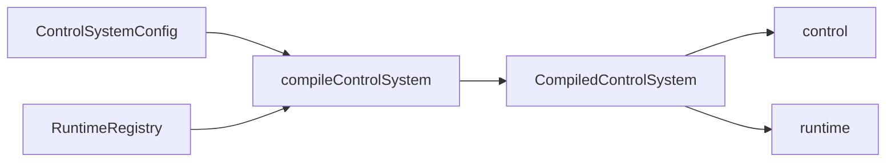

# `precurator`

[English](README.md) | Русский | [中文](README_ch.md)

`precurator` — TypeScript-библиотека для построения контуров управления для AI-систем поверх LangGraph с поддержкой checkpoint'ов.

Она пригодится, если у вас не одноразовый агент, а система, которая живет дольше одного удачного прогона. Когда уже мало просто "собрать граф и вызвать его", быстро всплывают другие требования: структурированные сигналы ошибок, ограниченная prompt-память, пауза и возобновление, режим `simulation`, а также внятная модель состояния, которую можно читать без раскопок во внутренностях chain'ов.

`precurator` не заменяет LangGraph. Скорее, он наводит порядок в тех местах, которые в чистом LangGraph обычно приходится собирать вручную: JSON-ready конфиг как источник истины, привязка обработчиков через registry, явное разделение `control` и `runtime`, а также lifecycle для долгоживущих thread'ов, а не только для одноразового запуска.

## Требования

- Node.js `>=20`
- Bun `>=1.2`

## Установка

```bash
npm install @piklv/precurator @langchain/core @langchain/langgraph zod
```

```bash
bun add @piklv/precurator @langchain/core @langchain/langgraph zod
```

`@langchain/core`, `@langchain/langgraph` и `zod` подключаются как peer dependencies. Благодаря этому `precurator` легко встраивается в существующий стек LangGraph и не тянет за собой дублирующиеся рантаймы или навязанный выбор провайдера.

## Зачем нужен `precurator`

LangGraph достаточно гибок, чтобы собрать все это вручную. На короткой дистанции это удобно. Но чем дольше живет система, тем быстрее выясняется, что рабочий сценарий и управляемый рантайм - не одно и то же.

Как только системе нужно жить дольше одного-двух шагов, переживать паузы, держать prompt-facing память в разумных пределах, отдавать машиночитаемые сигналы прогресса и отделять dry-run от работы с реальным миром, задача уже не сводится к "добавим еще одну node". Приходится договариваться о правилах самого выполнения.

`precurator` как раз про это.

Ее стоит использовать, если вашей системе нужно большинство из следующего:

- сериализуемый `ControlSystemConfig` как каноническое описание цикла;
- четкая граница между domain truth в `control` и служебным состоянием выполнения в `runtime`;
- детерминированные условия остановки: `epsilon`, `maxIterations`, решение verifier'а или token budget;
- `interrupt`, `resume` и `abort`, работающие поверх checkpoint'ов;
- ограниченная память с явной компакцией вместо бесконечно растущей prompt history;
- ветки `simulation: true`, которые не могут исподтишка выполнять разрушительные side effects;
- telemetry, пригодная для операторов, дашбордов и аудитных сценариев.

Если вы пишете короткого одноразового агента или почти линейный workflow, обычного LangGraph часто вполне хватает. `precurator` становится полезен там, где уже важны drift, convergence, вмешательство оператора и воспроизводимое поведение lifecycle.

Это инфраструктура для AI-агентов, вдохновленная идеями управления, а не пакет для классического control-analysis. Термины здесь взяты из observation, comparison, verification и correction, потому что через них удобно описывать цикл, но сама реализация остается вполне прикладной: TypeScript, LangGraph и явные runtime-контракты.

## Как на это смотреть

Точка входа — `compileControlSystem(config, runtimeRegistry)`.

- `config` описывает, что именно представляет собой система, в JSON-ready виде.
- `runtimeRegistry` содержит все, что нужно на этапе выполнения: evolvers, comparators, verifiers, tools, models, summarizers и checkpointer.
- результат компиляции по-прежнему остается рантаймом LangGraph, но уже с более явным контрактом на состояние, lifecycle и безопасность.



Здесь важны две идеи.

### 1. Конфиг остается сериализуемым

`ControlSystemConfig` хранит ссылки вроде `evolveRef`, `verifierRef`, `comparatorRef`, `toolRefs` и `modelRef`.

Это не "магические строки", а устойчивые ключи в `RuntimeRegistry`. Смысл в том, чтобы config и checkpointed state оставались JSON-ready, а реальные handlers, SDK clients, models и tools подключались уже в текущем процессе.

Именно такое разделение делает один и тот же декларативный цикл сериализуемым, тестируемым и безопасным для checkpoint'ов.

### 2. Состояние разделено намеренно

`ControlState<TTarget, TCurrent>` разделен на два слоя:

- `control`: target, текущее состояние домена, структурированные сигналы ошибок, ограниченная краткосрочная память и опциональный prediction;
- `runtime`: номер итерации, status, причина остановки, diagnostics, метаданные checkpoint'а, token budget, флаг simulation, human decisions и trace metadata.

За счет этого долгоживущий запуск проще разбирать. `runtime` показывает, как ведет себя цикл, а `control` остается источником истины о том, что именно система пытается изменить.

## Что именно выполняется

Публичный цикл проще всего понимать так:

`evolve -> compare -> verify -> compactMemory`

- внутри нет скрытого planner node с "секретной" оркестрацией;
- `evolve`: этот публичный шаг может читать, воздействовать и затем возвращать следующий `current`-стейт;
- если в вашем домене есть более богатое планирование или исполнение эффектов, вы моделируете это явно через evolver, comparator, verifier и runtime tools.

## Быстрый старт

Минимальный запускаемый пример находится в `examples/hello-world/`. Он специально сделан простым: цель здесь не изобразить реалистичного агента, а показать контракт lifecycle в самой короткой форме.

```ts
import { z } from "zod";
import { compileControlSystem } from "@piklv/precurator";

const system = compileControlSystem(
  {
    schemas: {
      target: z.object({ value: z.number() }),
      current: z.object({ value: z.number() })
    },
    stopPolicy: {
      epsilon: 0.05,
      maxIterations: 3
    },
    memory: {
      maxShortTermSteps: 4,
      compactionStrategy: "summarize-oldest",
      summaryReplacementSemantics: "replace-compacted-steps"
    },
    evolveRef: "increment-evolver",
    verifierRef: "pause-once-verifier"
  },
  {
    evolvers: {
      "increment-evolver": ({ current, target }) => ({
        value: Math.min(current.value + 2, target.value)
      })
    },
    verifiers: {
      "pause-once-verifier": ({ current, history }) => {
        if (current.value === 4 && history.length === 1) {
          return {
            status: "awaiting_human_intervention" as const,
            stopReason: "manual-review"
          };
        }

        return {
          status: "optimizing" as const
        };
      }
    }
  }
);

const interrupted = await system.invoke({
  target: { value: 50 },
  current: { value: 2 },
  metadata: {
    thread_id: "hello-world"
  }
});

const snapshot =
  interrupted.runtime.status === "awaiting_human_intervention"
    ? await system.resume(interrupted, {
        current: { value: 5 },
        humanDecision: {
          action: "resume",
          approvedBy: "operator"
        }
      })
    : interrupted;
```

### Как читать этот пример

В примере есть несколько специально оставленных упрощений:

- `"increment-evolver"` — это просто ключ в registry. Конфиг хранит ссылку, а runtime registry сопоставляет ее с реальным handler.
- evolver увеличивает значение на `2`, чтобы движение было детерминированным и понятным с первого взгляда.
- `epsilon: 0.05` и `maxIterations: 3` выбраны не ради оптимального поведения. Они нужны, чтобы пример оставался коротким, но все равно показывал, как подключается stop policy.
- `"pause-once-verifier"` — verifier, чья единственная задача один раз поставить цикл на паузу через checkpoint, чтобы в минимальном примере появились `awaiting_human_intervention`, `resume()` и `humanDecision`.
- `current.value === 4 && history.length === 1` — не эвристика управления, а просто правило: "поставь паузу один раз после первого завершенного шага".
- `thread_id: "hello-world"` дает запуску устойчивый идентификатор thread'а в LangGraph, чтобы checkpoint'ы и последующие чтения состояния оставались привязаны к одному и тому же thread'у.
- `resume(..., { current: { value: 5 } })` показывает, как оператор может вручную скорректировать состояние. Это демонстрация API для вмешательства, а не рекомендация подменять обычную эволюцию состояния ручными правками.

Даже в таком маленьком примере уже видна базовая форма библиотеки:

- скомпилированный рантайм LangGraph с типизированными `invoke`, `interrupt`, `resume`, `abort`, `getState` и `getThreadConfig`;
- модель состояния, где `runtime.status`, `stopReason` и `diagnostics` - это не случайные побочные данные, а важная часть контракта;
- ограниченную prompt-facing память, которая остается сериализуемой и безопасной для checkpoint'ов.

Если нужен самый короткий путь через lifecycle, начните с `examples/hello-world/`.

## Что библиотека дает на практике

### Lifecycle с учетом checkpoint'ов

`precurator` смотрит на долгоживущее выполнение как на lifecycle, а не как на ad-hoc цикл вокруг `invoke()`.

Вы можете:

- поставить паузу, вернув `awaiting_human_intervention` из verifier'а или вызвав `interrupt(snapshot, humanDecision?)`;
- продолжить выполнение через `resume(snapshot, { current?, humanDecision? })`;
- завершить через `abort(snapshot, humanDecision?)`;
- восстановить thread через `getState()` и `getThreadConfig()`.

Контракт строится вокруг checkpoint'ов LangGraph, а не вокруг скрытого suspended state в памяти.

### Comparator и verifier решают разные задачи

`precurator` жестко разводит comparison и verification.

- comparators вычисляют `errorVector`, `errorScore`, `deltaError`, `errorTrend` и при необходимости `prediction`;
- verifiers решают, должен ли цикл продолжаться, остановиться, завершиться ошибкой или эскалировать ситуацию.

Для реальных систем это важное различие. Компонент, который считает ошибку, не обязан быть тем же самым компонентом, который решает, что прогресс вообще можно засчитать.

### `simulation` — это граница безопасности

Передайте `simulation: true` в `invoke()`, и рантайм выполнит изолированную preview-ветку.

В режиме simulation:

- у ветки свое пространство имен thread'ов;
- destructive tools блокируются, если они явно не поддерживают `dryRun`;
- состояние остается сериализуемым и не смешивается с основной веткой;
- один и тот же цикл может сравнивать preview и реальность, не перенося side effects между ними.

Это полезно, когда системе нужно сначала "проиграть" траекторию, а уже потом воздействовать на реальную инфраструктуру, данные или пользователей.

### Ограниченная память — часть контракта

`shortTermMemory` намеренно конечна.

Она хранит:

- рабочее окно в `steps`;
- опциональную `summary` для скомпактированного старого контекста.

Встроенные стратегии компакции:

- `sliding-window`
- `summarize-oldest`
- `hybrid`

При необходимости можно подключить собственный summarizer через `RuntimeRegistry.summarizeCompactedSteps`.

Суть не в самом списке стратегий. Важно, что prompt-facing память ограничена контрактом, а не оставлена бесконтрольно разрастаться в transcript.

### Telemetry остается вне checkpointed state

Скомпилированная система испускает runtime lifecycle events:

- `step:completed`
- `step:interrupted`

Payload'ы включают такие поля, как `error_score`, `delta_error`, `error_trend`, `simulation`, `checkpoint_id` и, при необходимости, `thread_id`.

Это позволяет строить дашборды, трассировки, отчеты и alerting, не протаскивая closures или UI-коллекторы в checkpointed state.

## Как это встраивается в реальный проект

Обычно интеграция выглядит не как "заменить все на `precurator`", а скорее так:

1. сохранить вашу доменную модель и логику LangGraph-приложения;
2. описать контракт control loop'а через `ControlSystemConfig`;
3. привязать реальные evolvers, verifiers, tools, models и checkpointer в `RuntimeRegistry`;
4. отдать `precurator` lifecycle-инварианты: bounded memory, stop policy, безопасность `simulation`, checkpoint-aware паузы и структурированные diagnostics.

На практике это обычно означает следующее:

- SDK clients, database handles и provider instances живут в registry, а не в config или state;
- domain-specific логика observation или actuation может остаться внутри handlers, которые вам уже понятны;
- существующий harness-код часто можно спрятать за `evolveRef`, `toolRefs` или `verifierRef`;
- управление thread'ами и checkpoint'ами становится явной задачей рантайма, а не набором случайных helper'ов.

Если вы уже используете LangGraph, удобнее всего воспринимать `precurator` как слой, который наводит порядок в stateful agent loop'ах с длинным горизонтом.

## Примеры

### `examples/hello-world/`

Это самый короткий путь к публичному lifecycle:

- компиляция из config и registry;
- запуск thread'а;
- пауза через verifier;
- `resume` с участием оператора;
- просмотр итогового runtime state.

Используйте этот пример, чтобы быстро понять API, а не как шаблон готового боевого агента.

### `examples/aeolus/`

`Aeolus` — более содержательный пример. Он полезен, если хочется посмотреть не на игрушечный счетчик, а на длинный сценарий с preview, внешним disturbance и телеметрией.

Живое демо: [pikulev.github.io/precurator](https://pikulev.github.io/precurator/)

Он показывает:

- `simulation: true` как preview-ветку с отключенным disturbance;
- ветку реальности, в которой тот же цикл сталкивается с внешним disturbance;
- escalation через verifier, когда предсказанное и наблюдаемое движение расходятся;
- compaction ограниченной памяти с видимым сигналом `summary`;
- сбор telemetry и генерацию отчетов вне checkpointed state.

Заодно этот пример показывает, где именно живет доменная логика.

- динамика "plant" в духе физической модели реализована в `examples/aeolus/domain.ts`;
- оркестрация цикла приходит из `precurator`;
- воспроизводимость обеспечивается явным seeded context, а не скрытой магией рантайма;
- collector дашборда остается вне `ControlState`, и для системы с checkpoint'ами это как раз правильное разделение.

Если `hello-world` нужен, чтобы быстро понять API, то `Aeolus` показывает, как тот же подход выглядит в более живом сценарии.

Более подробный разбор смотрите в `docs/EXAMPLE-AEOLUS.md`.

Локально отчет можно сгенерировать через `bun run demo:aeolus`. Сборка артефакта для GitHub Pages: `bun run build:pages`.

## Краткий обзор контрактов

Чтобы понять библиотеку, не нужно заучивать всю поверхность типов. Для первого чтения достаточно этих контрактов.

### `ControlSystemConfig<TTarget, TCurrent>`

Описывает цикл в JSON-ready виде.

- `schemas?`: Zod-валидация для `target` и `current`
- `stopPolicy`: `{ epsilon, maxIterations, maxTokenBudget? }`
- `memory?`: поведение bounded memory
- `mode?`: `"conservative" | "balanced" | "aggressive"`
- `modelRef?`, `evolveRef?`, `verifierRef?`, `comparatorRef?`, `toolRefs?`

### `RuntimeRegistry<TTarget, TCurrent>`

Разрешает ссылки из config в исполняемое поведение рантайма.

- `models?`
- `evolvers?`
- `verifiers?`
- `comparators?`
- `tools?`
- `tokenBudgetEstimator?`
- `summarizeCompactedSteps?`
- `checkpointer?`

### `ControlState<TTarget, TCurrent>`

Контракт inspectable state.

- `control`: target, текущее состояние, сигналы ошибок, ограниченная память и опциональный prediction
- `runtime`: status, итерация, diagnostics, метаданные checkpoint'а, флаг simulation и контекст оператора

### `CompiledControlSystem<TTarget, TCurrent>`

Рантайм, который вы действительно запускаете.

- `invoke()`
- `interrupt()`
- `resume()`
- `abort()`
- `getState()`
- `getThreadConfig()`
- `on()`

## Детерминированные вспомогательные функции

Для синтетических тестов и детерминированных циклов пакет также экспортирует helper'ы:

```ts
import { deriveErrorTrend, deterministicComparator } from "@piklv/precurator";

const comparison = deterministicComparator({
  target: { value: 10 },
  current: { value: 7 },
  previousErrorScore: 0.5
});

const trend = deriveErrorTrend([0.5, 0.3, 0.4]);
```

Эти helper'ы полезны, если вы хотите тестировать convergence и поведение verifier'а без живой модели в цикле.

## Разработка

```bash
bun install
bun run verify
bun run demo:aeolus
```

## Структура репозитория

- `src/`: публичные контракты, runtime-реализация, comparator и helper'ы для памяти
- `tests/`: unit, integration, packaging и typing-проверки
- `examples/hello-world/`: минимальный запускаемый пример lifecycle
- `examples/aeolus/`: long-horizon демо с preview, disturbance, telemetry и report-артефактами
- `docs/`: ADR, разборы примеров, TDD plan и критерии готовности к публикации
- `.cursor/rules/`: постоянные инструкции для coding-агентов
